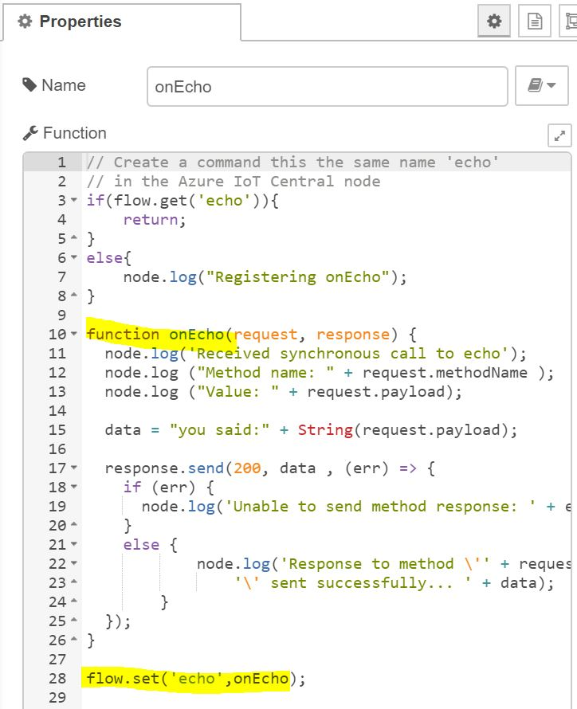

# Node-Red Azure IoT Central connector 
This connector allows you easily connect your node red project to Azure IoT Central, providing the Scope ID, Device ID and Primary Key created in Azure IoT Central portal for a specific Device unsing SAS connectivity. See [here][1] for more details.

This connector supports MQTT, AMQP, HTTP as transport. 

You can send telemetry from your device to the cloud as json playload; the payload must match the one expected by IoT Central if you want to visualize it.

## Commands

Commands from IoT Central (up to 5 ) to the device. For this scenario you have to use the method name used in IoT Central, when you have defined or imported the model. You fill the properties tab of the connector with the same command name, then define a Javascript function with the same name in your Node Red flow, as in following pictures.

Here is the 'echo' command:


Here the Javascript node in the flow:


The Javascript function must be registered at the flow context and invoked before calling the connector. In the sample a simple inject is used to register the function, but you can do in other ways. 



Here a template of Javascript code:

```javascript
// Create a command with the same name 'echo' used
// in Azure IoT Central model of the device
if(flow.get('echo')){
    return;   
}

function onEcho(request, response) {
  node.log('Received synchronous call to echo');
  node.log ("Method name: " + request.methodName );
  node.log ("Value: " + request.payload);
  
  data = "you said:" + String(request.payload);

  response.send(200, data , (err) => {
    if (err) {
      node.log('Unable to send method response: ' + err.toString());
    }
    else {
            node.log('Response to method \'' + request.methodName + '\' sent successfully... ' + data);
        }
  });
}

flow.set('echo',onEcho);

```

## Reported and Desired properties

The connector support desired properties (Cloud (W) -> device(R)) and reported properties (Device(W) -> Cloud (R)).

To react to a desired properties you have to register a Javascript function at the flow level and invoke it before using the connector, this because the connector expected that function already registered.

Here we are registering the Javscript function using a simple inject node, but you can use other ways.


This is a sample Javascript code used for the brightness properties, the value of the property is stored using the flow context.

```javascript
// this is a property written in IoT Central
// It'a a desired property for the device twin
function brightness(newValue)
{
    node.log("received desired prop from cloud:" + newValue);
    flow.set('brightness', newValue);
}

flow.set('brightness-handler',brightness);
```

If you want to sent a reported property create a json object that containe "resported.properties" field as follow.

```json
{
    "reported.properties": {
        "status": true,
        "nonexists": true,
        "climate": {
            "minTemperature": "68",
            "maxTemperature": "76"
        }
    }
}
```
## Install

    npm install node-red-contrib-azure-iot-central

This connector hass been written starting using this [sample code][2].

[1]:https://docs.microsoft.com/en-us/azure/iot-central/core/concepts-get-connected#connect-a-single-device
[2]:https://docs.microsoft.com/it-it/azure/iot-central/core/tutorial-connect-device

